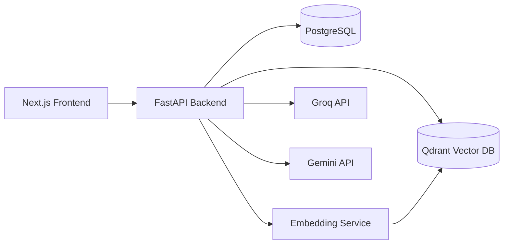

# Datalingo

Adaptive AI tutoring for Data Science and Business Analytics students.


Datalingo is a production-oriented adaptive tutoring platform that combines LLM orchestration, retrieval-augmented generation (RAG), Bayesian Knowledge Tracing (BKT), semantic memory systems, and real-time streaming UX. It is designed for serious education engineering use cases: personalized student learning, teacher analytics, and scalable AI-assisted pedagogy.

---

## 1. Hero Section

### Why Datalingo
Datalingo personalizes every response based on student mastery, session context, retrieved course material, and long-term learning memory. It supports both general Data Science tutoring and a dedicated Business Analytics multi-agent pipeline.

---

## 2. Features

- **Adaptive AI tutoring**: Response depth adapts to student mastery levels (beginner/intermediate/advanced).
- **Personalized learning**: User-specific weak-topic memory is injected only when pedagogically relevant.
- **Bayesian Knowledge Tracing (BKT)**: Topic mastery (`p_known`) updates after MCQ/prerequisite assessments.
- **RAG pipeline**: Semantic retrieval from course corpus and student-uploaded documents.
- **Long-term memory system**: Rolling session summaries + persisted user learning profile.
- **Teacher analytics dashboard**: Topic heatmaps, at-risk students, engagement, and mastery trends.
- **Business Analytics multi-agent pipeline**: Parallel memory agent, RAG agent, tool agent, and response agent.
- **SSE streaming chat**: Token-by-token low-latency response streaming.
- **Document upload + semantic retrieval**: PDF/DOCX/TXT/image ingestion with vector indexing.
- **MCQ prerequisite assessment**: Auto-triggered tiered checks before advancing to dependent topics.
- **Knowledge tracking**: Per-topic mastery and event-level learning telemetry.
- **AI-generated summaries**: Student learning summaries for teacher interventions.
- **Memory Palace system**: Structured BA student memory nodes + semantic memory fragments.

---

## 3. System Architecture



---

## 4. Tech Stack

### Frontend

| Technology | Purpose |
|---|---|
| Next.js 15+ | App Router UI, route protection, production frontend |
| React | Interactive chat + dashboards |
| TypeScript | Type-safe frontend code |
| Tailwind CSS | Utility-first styling |
| Zustand | Lightweight client-side state management |

### Backend

| Technology | Purpose |
|---|---|
| FastAPI | API orchestration and streaming endpoints |
| PostgreSQL | Relational data: users, sessions, mastery, analytics |
| Qdrant | Vector storage and semantic retrieval |
| Groq API | Fast inference for classification, tutoring, summaries |
| Gemini API | Multimodal BA workflows, document-aware reasoning |
| PM2 | Process supervision in VPS deployment |
| Uvicorn | ASGI server for FastAPI |

### AI/ML

| Component | Purpose |
|---|---|
| RAG | Ground responses with retrieved context |
| Bayesian Knowledge Tracing | Update topic mastery after assessments |
| Embeddings | Semantic vector representation of text/documents |
| Multi-agent orchestration | Parallel BA memory/retrieval/tool/response execution |
| Semantic search | Similarity retrieval from Qdrant collections |

---

## 5. Core AI Concepts

- **Bayesian Knowledge Tracing (BKT)**: Maintains probabilistic mastery (`p_known`) per user-topic and updates after each graded interaction.
- **RAG**: Retrieves high-signal chunks from course and uploaded corpora before generation.
- **Memory Palace**: Structured long-term BA topic memory (understanding summaries, misconceptions, examples, attempts).
- **Dream Queue**: Async memory extraction pipeline that converts sessions into durable semantic fragments.
- **Multi-agent orchestration**: BA flow runs dedicated agents in parallel for memory, retrieval, tool routing, and response synthesis.
- **Semantic retrieval**: Query embeddings search vector collections for context and historical learning signals.

---

## 6. Key Workflows

### Student Chat Flow
1. User sends message.
2. Backend stores message + resolves session.
3. Topic is classified.
4. Relevant chunks are retrieved (RAG).
5. Context engine injects mastery + memory.
6. Response streams via SSE.
7. Interaction is persisted for analytics and memory.

### BA Pipeline
1. Memory agent fetches palace context and weak prerequisites.
2. RAG agent retrieves course + personal doc chunks.
3. Tool agent detects/suggests BA tools (forge/formula/case/exam/brief).
4. Response agent synthesizes context and streams Gemini output.
5. Dream queue updates long-term memory artifacts.

### Document Upload Pipeline
1. Student uploads file.
2. Content extracted (langextract/Gemini fallback).
3. Document chunked and embedded.
4. Vectors upserted into per-user Qdrant collection.
5. Session memory updated with uploaded file metadata.

### Memory Extraction Pipeline
1. Session enters dream queue.
2. Conversation is parsed for topic-relevant learning signals.
3. Memory palace node is updated.
4. Memory fragments are embedded and indexed for future retrieval.

---

## 7. Project Structure

```text
/home/runner/work/datalingo/datalingo
├── backend/
│   ├── app/
│   │   ├── api/
│   │   │   ├── auth.py
│   │   │   ├── chat.py
│   │   │   ├── analytics.py
│   │   │   ├── admin.py
│   │   │   ├── documents.py
│   │   │   ├── ba_documents.py
│   │   │   └── ba_tools.py
│   │   ├── core/
│   │   │   ├── config.py
│   │   │   └── db.py
│   │   ├── models/
│   │   │   └── schemas.py
│   │   ├── services/
│   │   │   ├── cbkt.py
│   │   │   ├── context_engine.py
│   │   │   ├── llm_router.py
│   │   │   ├── ba_orchestrator.py
│   │   │   ├── ba_memory_service.py
│   │   │   └── ba_dream_agent.py
│   │   └── main.py
│   ├── migrations/
│   └── requirements.txt
├── frontend/
│   ├── app/
│   │   ├── login/
│   │   ├── student/
│   │   ├── business-analytics/
│   │   ├── teacher/
│   │   └── admin/
│   ├── components/
│   ├── lib/
│   ├── store/
│   ├── types/
│   └── proxy.ts
├── ecosystem.config.js
├── tunnel/
└── README.md
```

---

## 8. API Overview

### Auth
| Method | Route | Description |
|---|---|---|
| POST | `/auth/login` | Authenticate user and issue JWT |

### Chat
| Method | Route | Description |
|---|---|---|
| POST | `/chat/` | Main streaming chat endpoint |
| GET | `/chat/sessions` | List user sessions |
| GET | `/chat/sessions/{session_id}/messages` | Fetch session messages |
| DELETE | `/chat/sessions/{session_id}` | Delete session |
| POST | `/chat/check-prereqs` | Prerequisite assessment trigger |
| POST | `/chat/mcq-batch-generate` | Generate MCQ batch |
| POST | `/chat/mcq-batch-submit` | Submit MCQ answers |
| POST | `/chat/end-session` | Trigger long-term memory update |

### Analytics
| Method | Route | Description |
|---|---|---|
| GET | `/analytics/overview` | Class summary metrics |
| GET | `/analytics/students` | Student list + filters |
| GET | `/analytics/student/{user_id}` | Per-student detail |
| GET | `/analytics/topics` | Topic heatmap |
| GET | `/analytics/at-risk` | At-risk student detection |
| GET | `/analytics/ba/overview` | BA-specific overview |

### Admin
| Method | Route | Description |
|---|---|---|
| GET | `/admin/overview` | Platform KPI snapshot |
| GET | `/admin/system` | CPU/RAM/disk process telemetry |
| GET | `/admin/messages` | Paginated message logs |
| GET | `/admin/logs/errors` | Error logs |
| GET | `/admin/logs/api-usage` | Model usage logs |
| GET | `/admin/services/health` | Service health checks |
| GET/POST/PATCH/DELETE | `/admin/users...` | User lifecycle operations |

### BA Tools
| Method | Route | Description |
|---|---|---|
| POST | `/ba/tools/forge` | Concept Forge evaluation |
| POST | `/ba/tools/exam/generate` | Generate case-based exam question |
| POST | `/ba/tools/exam/submit` | Grade exam answer |
| POST | `/ba/tools/brief` | Pre-class brief generation |
| POST | `/ba/tools/case-chat` | Streaming case study chat |

---

## 9. Screenshots

> Add product screenshots/GIFs here.


---

## 10. Installation

### 1) Clone
```bash
git clone https://github.com/alwayselse/datalingo.git
cd datalingo
```

### 2) Backend setup
```bash
cd ./backendbackend
python -m venv .venv
source .venv/bin/activate  # Windows: .venv\Scripts\activate
pip install -r requirements.txt
```

### 3) Frontend setup
```bash
cd ./frontend
npm ci
```

### 4) Environment configuration
Create `.env` at:

```text
.env
```

(Use the table in **Environment Variables** below.)

### 5) Run services

Backend:
```bash
cd ./backend
source .venv/bin/activate
uvicorn app.main:app --host 127.0.0.1 --port 8000 --reload
```

Frontend:
```bash
cd ./frontend
npm run dev
```

(Optional) Embedding service should be running on `http://127.0.0.1:8001`.

---

## 11. Environment Variables

| Variable | Required | Example | Description |
|---|---|---|---|
| `POSTGRES_HOST` | Yes | `127.0.0.1` | PostgreSQL host |
| `POSTGRES_PORT` | Yes | `5433` | PostgreSQL port |
| `POSTGRES_DB` | Yes | `rag_db` | Database name |
| `POSTGRES_USER` | Yes | `rag_user` | DB username |
| `POSTGRES_PASSWORD` | Yes | `********` | DB password |
| `QDRANT_HOST` | Yes | `127.0.0.1` | Qdrant host |
| `QDRANT_PORT` | Yes | `6333` | Qdrant port |
| `QDRANT_COLLECTION` | Yes | `rag_chunks` | Default vector collection |
| `SECRET_KEY` | Yes | `super-secret` | JWT signing secret |
| `ALGORITHM` | No | `HS256` | JWT algorithm |
| `ACCESS_TOKEN_EXPIRE_MINUTES` | No | `1440` | JWT expiry |
| `GROQ_API_KEY` | Yes | `gsk_...` | Groq API key |
| `GEMINI_API_KEY` | Yes | `AIza...` | Gemini API key |
| `GEMINI_MODEL` | No | `gemini-2.5-flash-lite` | Gemini model for BA workflows |
| `EMBEDDING_MODEL_NAME` | No | `all-MiniLM-L6-v2` | Embedding model metadata |
| `EMBEDDING_SERVICE_URL` | Yes | `http://127.0.0.1:8001` | Embedding API base URL |
| `BA_UPLOAD_DIR` | No | `/home/deploy/uploads/ba` | BA document upload directory |
| `CBKT_LEARNING_PROBABILITY` | No | `0.2` | BKT learning probability |
| `CBKT_SLIP_PROBABILITY` | No | `0.1` | BKT slip probability |
| `CBKT_GUESS_PROBABILITY` | No | `0.2` | BKT guess probability |
| `CBKT_INITIAL_MASTERY` | No | `0.3` | Initial mastery prior |
| `RETRIEVAL_TOP_K` | No | `5` | Retrieval depth |
| `ALLOW_ORIGINS` | No | `http://localhost:3000` | CORS origins |

---

## 12. Deployment

Datalingo is set up for VPS-style deployment with PM2 process supervision.

### PM2 Process Layout
Defined in `./ecosystem.config.js`:

- `datalingo-backend`: Uvicorn + FastAPI
- `datalingo-frontend`: Next.js `start`
- `datalingo-embedding`: Embedding service

### Production Runtime Pattern
- **FastAPI/Uvicorn** serves APIs and SSE streaming.
- **Next.js** serves web app on port 3000.
- **PostgreSQL** stores sessions, mastery, analytics, logs.
- **Qdrant** stores vector embeddings for RAG and memory.
- Process restart/fault recovery handled by PM2.

---

## 13. Scalability & Future Improvements

- Introduce **Redis caching** for hot retrieval and session metadata.
- Move to **async DB driver** and non-blocking query paths.
- Deploy with **Kubernetes** for horizontal scaling.
- Redesign **session architecture** for cleaner long-chat handling.
- Use **distributed embedding services** and autoscaling workers.
- Shift Dream Queue + heavy AI tasks into dedicated **queue workers**.

---

## 14. Research / Engineering Highlights

- Adaptive prompting using mastery-aware context.
- Sliding-window conversational memory with summarization checkpoints.
- Long-term memory injection only when pedagogically relevant.
- Semantic memory retrieval from per-user memory vectors.
- Multimodal document handling with Gemini-aware uploads.
- SSE token streaming for responsive conversational UX.
- AI-driven student analytics and teacher-facing summaries.

---

## 15. Contributing

Contributions are welcome.

1. Fork the repository.
2. Create a feature branch.
3. Make focused, testable changes.
4. Run lint/build checks locally.
5. Open a Pull Request with clear context and screenshots (if UI changes).

---

## 16. Author

Built by **Nikhil Jha**.
